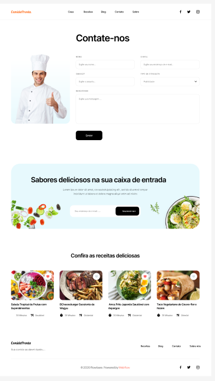

# Criando um Wireframe de Média Fidelidade

## Descrição do Projeto

Este projeto faz parte do desafio de **Formação UX Designer**, onde o objetivo é criar um **Wireframe de Média Fidelidade** para uma interface de usuário (UI). O projeto tem como tema uma página de contato e apresentação de receitas, onde o foco foi construir um layout funcional, com elementos de navegação, campos de input, e um design simples para garantir usabilidade e fluxo visual adequado.

## Objetivo do Desafio

O objetivo principal foi criar um wireframe que demonstra:

- A organização estrutural da interface.
- Funcionalidades básicas e navegação entre seções.
- Uso de textos, botões e campos interativos.
  
Este wireframe é considerado de média fidelidade porque foca na estrutura e usabilidade, sem entrar em detalhes visuais completos como cores definitivas ou gráficos detalhados.

## Tecnologias Utilizadas

- **Figma**: A ferramenta utilizada para a criação do wireframe.
- **Markdown**: Para documentação e descrição do projeto.

## Estrutura do Projeto

- **Comida Pronta.fig**: Arquivo nativo do Figma que contém o wireframe de média fidelidade desenvolvido.
- **Comida Pronta.pdf**: Exportação em PDF do wireframe para fácil visualização e compartilhamento.
- **ComidaPronta.PNG**: Imagem representativa do wireframe.

### Prévia do Wireframe

## Instruções para Visualização

1. Para visualizar e editar o wireframe diretamente no Figma, utilize o arquivo `Comida Pronta.fig`. Importe-o no Figma, caso necessário.
2. Para uma visualização rápida, abra o arquivo `Comida Pronta.pdf`, que contém uma versão exportada do wireframe.
3. A imagem `ComidaPronta.png` também oferece uma prévia do wireframe.

## Considerações Finais

Este wireframe demonstra um layout funcional para uma página de contato e receitas, com foco na simplicidade de navegação e clareza de informações. Ele pode servir como base para futuras iterações e refinamentos no design de alta fidelidade.
